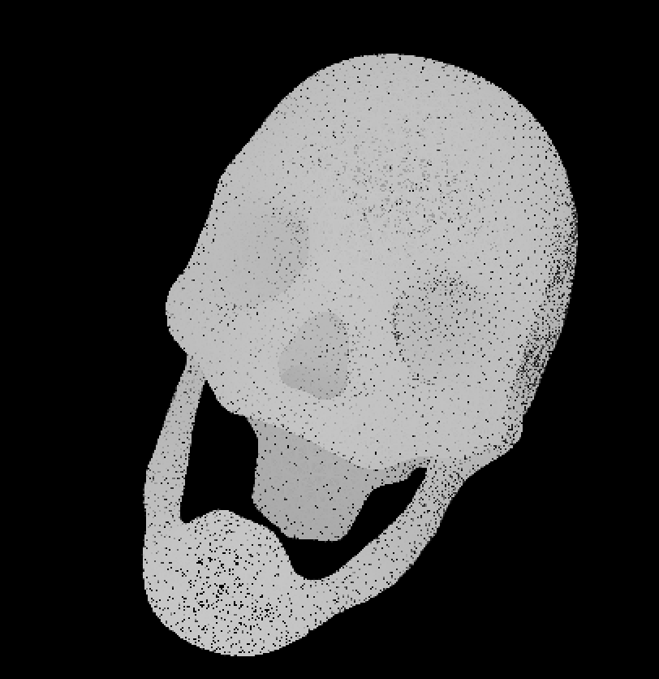
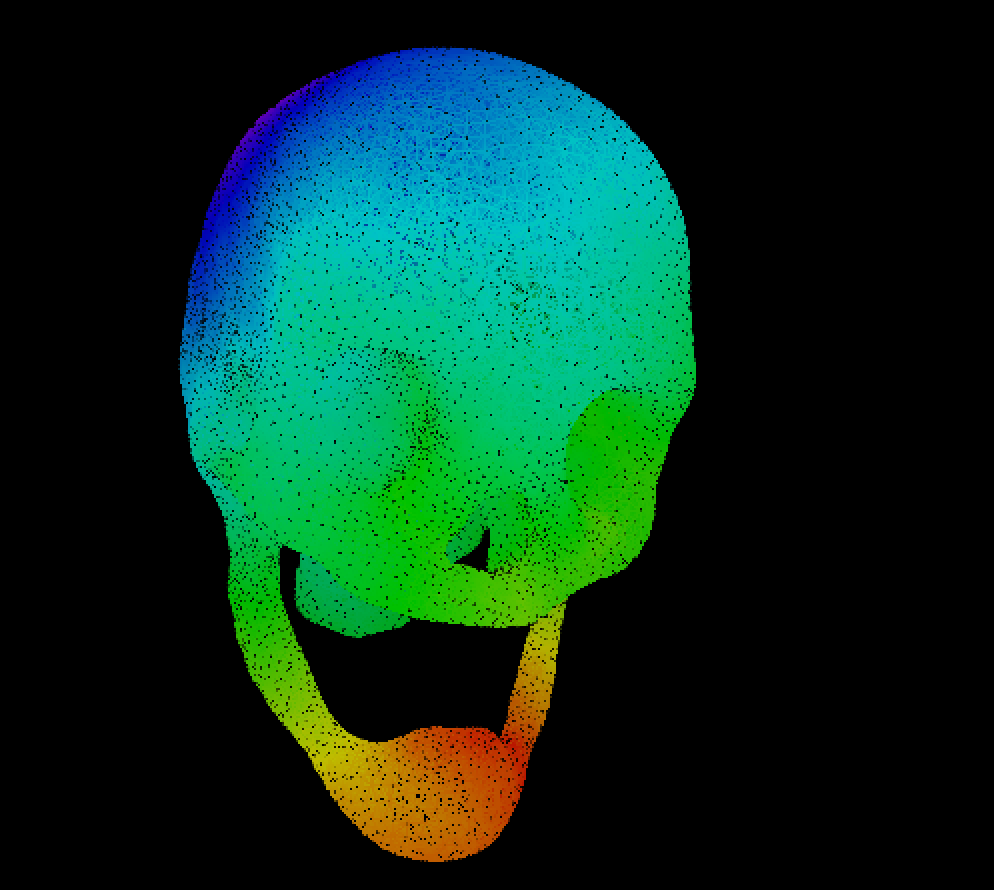
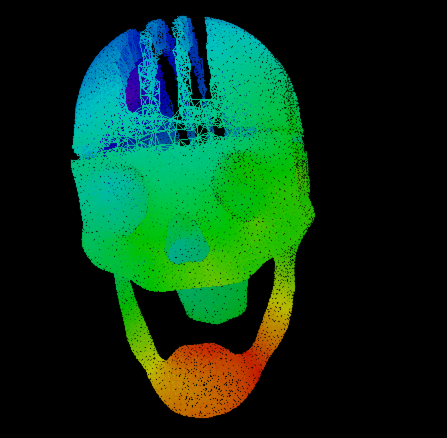
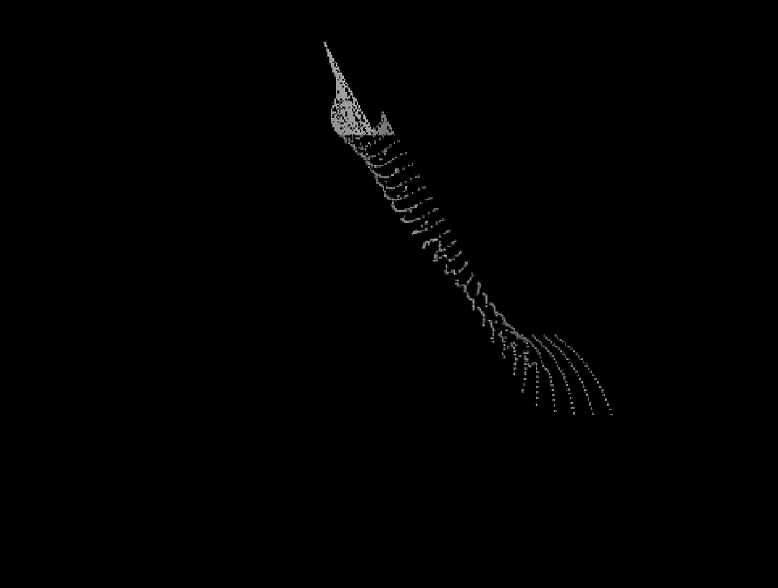

# Graphs and Operations on Graphs

Contributors: Tuan Nguyen, Cris Cecka

This is a quarter long project in CME 212   Software Development at Stanford.

```Graph.hpp``` provides construction of objects representing graphs, with elements
being nodes and edges. Nodes and edges may store data of any type, and computations
on their values can be carried out using appropriate member functions. Some examples
include:
* Visualize a graph. Example: visualizing a skull by a graph. See ```viewer.cpp```.



* Compute the shortest path in a graph. Example: color the above skull using a colormap based on the shortest path lengths from a given root node. See ```shortest_path.cpp```.



* Create a subgraph of a parent graph, given some criteria. Example: make a mohawk model out of the above skull. See ```subgraph.cpp``` and ```combine_sub_short.cpp```.



* Simulate a physical process on a graph. Example: visualize movements of a piece of fabric using a mass spring model. See ```mass_spring.cpp```.



* Represent a matrix free linear operator by wrapping a Graph object in an MTL operator. Example: solve a Poisson equation.  See ```poisson.cpp``` (work in progress).  
